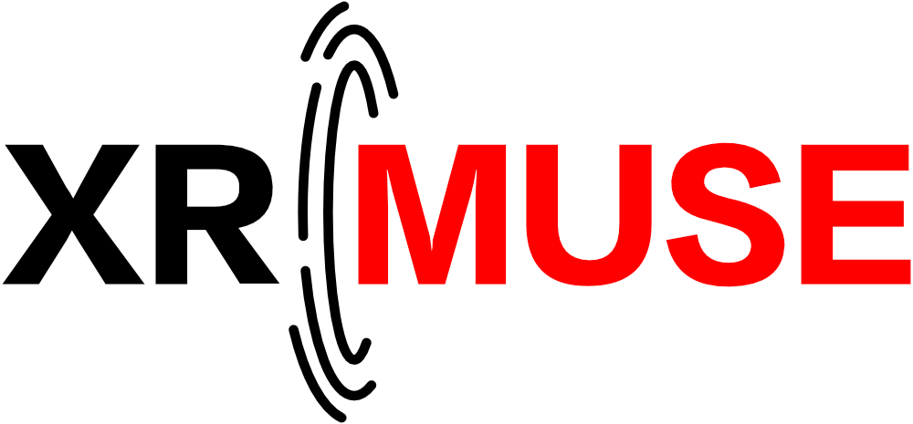

  

  <h3 align="center">An Open-Source Unity Framework for Extended Reality-Based Networked Multi-User Studies </h3>
  
<i>St&#233;ven Picard, Ningyuan Sun, and Jean Botev</i>

 

This repository contains an open-source Unity framework for conducting XR-based user studies on collaborative tasks, providing various ready-to-use components and a demo scene that researchers can easily customize and adapt to their specific needs.
The framework consists of four Unity packages as summarized in the table below.

| Package | Description |
| --- | --- |
| `XRMUSE.ExampleScene` | This package provides an example setup, where two users work collaboratively to accomplish an industrial assembly task. The scene is held generic to offer a baseline environment that can be customized for other collaborative activities. |
| `XRMUSE.Networking` | This package contains a collection of scripts for networking-related functionalities, including server connection, data synchronization, object pooling, networked physics, and more. The scripts are built upon Photon Unity Network and use its free remote server to connect different XR devices. |
| `XRMUSE.SceneDescription` | This package provides an operation system that allows researchers to describe the environment (e.g., creating certain GameObjects at specific positions, triggering certain events) with text files following a specific syntax. These files are loaded and interpreted by the application to construct the shared environment. |
| `XRMUSE.Utilities` | This package encapsulates other generic functionalities that do not fit the above-mentioned packages, such as custom collisions and spatial calibration. |

## Requirements

Environment
- A rectangular table and enough empty space around the table. The table ideally should be least 1 meters long and 0.6 meters wide.

Hardware

- Two XR Headsets, either Vive XR Elite or Meta Quest 3. It should be possible to use different headsets between users.

Dependencies on all versions

- Photon Unity Network (PUN2)
- XR Interaction Toolkit (2.5.4)
- Shader Graph (14.0.9)
- TextMeshPro (3.0.6)

Dependencies specific to the Vive XR Elite version

- VIVE Wave XR Plugin (5.6.0-r.10)
- VIVE Wave XR Plugin - Essence (5.6.0-r.10)
- VIVE Wave XR Plugin - Native (5.6.0-r.10)

Dependencies specific to the Meta Quest version

- Unity OpenXR Meta

## Demo Setup for Vive XR Elite
1. Create a new Unity project (3D Built-in Render Pipeline) with Unity 2022.3.16f1 or higher.

1. Set up the Wave XR Plugin following [this tutorial](https://hub.vive.com/storage/docs/en-us/UnityXR/UnityXRGettingStart.html) ([Archive version](https://web.archive.org/web/20240416174408/https://hub.vive.com/storage/docs/en-us/UnityXR/UnityXRGettingStart.html)) up until the step "Building a simple scene" (excluded). Make sure to use the `Multi Pass` renderer mode.

1. Set up the Wave XR Trackable Marker extension following [this tutorial](https://hub.vive.com/storage/app/doc/en-us/UnityXR/UnityXRTrackableMarker.html) ([Archive version](https://web.archive.org/web/20240225193033/https://hub.vive.com/storage/app/doc/en-us/UnityXR/UnityXRTrackableMarker.html)) up until the step "How to use" (excluded).

1. Import the following packages:
    - via Unity Package Manager:
      - Shader Graph
      - TextMeshPro
      - XR Interaction Toolkit (Choose 'Yes' if it asks whether to use the new input system.)
        - Import the 'Starter Assets' under the `Samples` tab.
    - via Unity Asset Store
      - [Photon PUN2](https://assetstore.unity.com/packages/tools/network/pun-2-free-119922)

1. Set up Photon AppID through the automatic setup wizard. If the wizard did not pop up after importing the Photon PUN2 package, you can open it under `Window` > `PUN Wizard` > `Setup Project`.

1. Go to `Window` > `TextMeshPro`, and click on `Import TMP Essential Resources`.

1. In `Project Settings`, go to `Player` > `Other Settings`:
    - Set up your `Company Name` and `Product Name`.
    - Under the `Android` tab:
      - Set `Minimum API Level` to 29.
      - Set `Target API Level` to 32.
      - Set `Active Input Handling` to 'Both'.
      - Add 'XRMUSE_XRE' to `Scripting Define Symbols`.

1. Clone or copy this repository into the Assets folder of the Unity project.

1. Open the example scene / `<UnityProject>` / `Assets` / `UniLuVR-packages` / `UniLuVR.ExampleScenario` / `Example Scenes` / `Example Scene for Vive XR Elite`.

1. Build the scene into a .apk file and install it onto the headsets. Then launch the application on the headsets to initialize the application's internal storage.

1. Quit the application. Copy eveything under / `<UnityProject>` / `Assets` / `Example Configuration Files~` / `User 1` into one headset at / `<HeadsetInternalStorage>` / `Android` / `data` / `<CompanyName>.<ProductName>` / `files`. Then copy everything under / `<UnityProject>` / `Assets` / `Example Configuration Files~` / `User 2` into the other headset at the same path.

1. Print the marker below (roughly 12cm * 12cm) and place it at the table's center. Launch the application on both headsets and follow the in-app instructions.

 

## Demo Setup for Meta Quest 3

1. Create a new Unity project (3D Built-in Render Pipeline) with Unity 2022.3.16f1 or higher.

1. Import the following packages:
    - via Unity Package Manager:
      - Unity OpenXR Meta (Choose 'Yes' if it asks whether to use the new input system.)
      - Shader Graph
      - TextMeshPro
      - XR Interaction Toolkit
        - Import the 'Starter Assets' under the `Samples` tab.
    - via Unity Asset Store
      - [Photon PUN2](https://assetstore.unity.com/packages/tools/network/pun-2-free-119922)

1. Set up Photon AppID through the automatic setup wizard. If the wizard did not pop up after importing the Photon PUN2 package, you can open it under `Window` > `PUN Wizard` > `Setup Project`.

1. Go to `Window` > `TextMeshPro`, and click on `Import TMP Essential Resources`.

1. In `Project Settings`, go to `XR Plug-in Management` 
    - Tick `Open XR` the Android tab.
    - In the navigation list on the left:
      - Go to `OpenXR`
        - Set `Render Mode` to 'Multi-pass'.
        - Add 'Oculus Touch Controller Profile'.
        - Tick `Meta Quest`.
      - Go to `Project Validation`:
        - click on `Fix All`.

1. In `Project Settings`, go to `Player` > `Other Settings`:
    - Set up your `Company Name` and `Product Name`.
    - In `Target Architectures`, only tick 'ARM64'.

1. Clone or copy this repository into the Assets folder of the Unity project.

1. Open the example scene / `<UnityProject>` / `Assets` / `XR_MUSE.ExampleScenario` / `Example Scenes` / `Quest Scene`.

1. In `Build Settings`, switch the target platform to Android. Build the scene into a .apk file and install it onto the headsets. Then launch the application on the headsets to initialize the application's internal storage.

1. Quit the application. Copy eveything under / `<UnityProject>` / `Assets` / `Example Configuration Files~` / `User 1` into one headset at / `<HeadsetInternalStorage>` / `Android` / `data` / `<CompanyName>.<ProductName>` / `files`. Then copy everything under / `<UnityProject>` / `Assets` / `Example Configuration Files~` / `User 2` into the other headset at the same path.

1. Launch the application on both headsets and follow the in-app instructions. The spatial calibration for the Quest version differs from the one above for Vive XR Elite. The anchor needs to be manually moved to the table's center using controllers.

| Control | Action |
| --- | --- |
| Right controller joystick | Move the anchor left, right, forward, or backward.
| Right controller A button | Move the anchor down. |
| Right controller B button | Move the anchor up. |
| Left controller X button | Rotate the anchor clockwise. |
| Left controller Y button | Rotate the anchor counter-clockwise. |
| Left controller trigger button | Confirm. |

## Acknowledgements

This project has received funding from the European Union’s Horizon 2020 research and innovation programme under grant agreement No 964464 (ChronoPilot).
